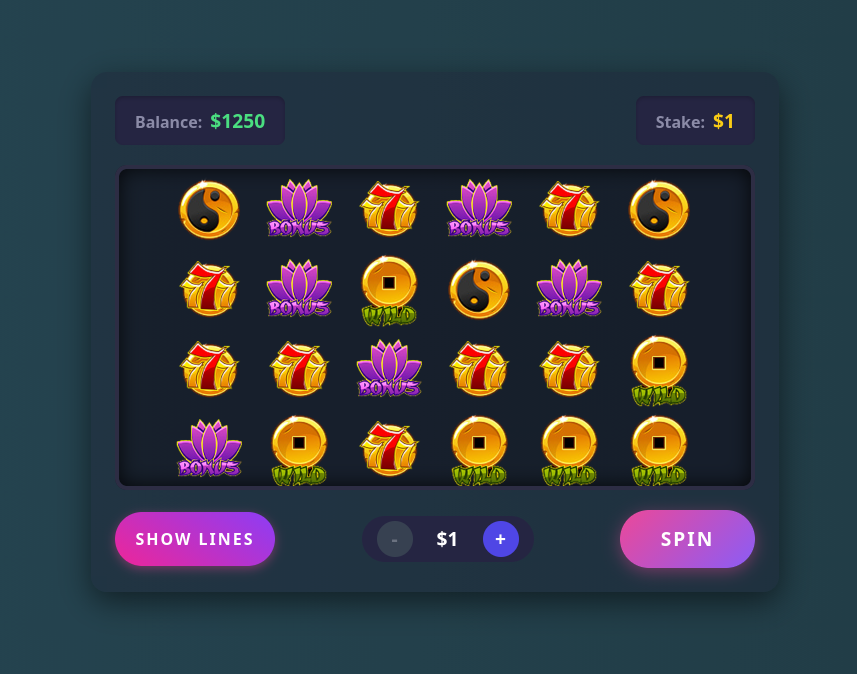

# 🎰 High-Performance iGaming Slot Engine

A Full-stack slot machine engine built with modern web technologies. This project demonstrates a complete iGaming flow, from server-side RNG (Random Number Generation) matrix calculations to high-fidelity, synchronized WebGL animations on the client

## ✨ Key Features

- **True Client-Server Architecture:** The frontend acts purely as a visual renderer. All RNG, matrix generation, and payout calculations are strictly isolated on the Node.js backend.
- **Queue-Based Symbol Synchronization:** Solves the classic game dev "tunneling" problem. The WebGL engine uses a deterministic texture queue to ensure reels stop _exactly_ on the server-provided matrix, regardless of browser FPS drops or lag.
- **Advanced GSAP Animations:** Features infinite idle spinning that seamlessly resolves into the target matrix upon receiving the server response, utilizing `overwrite` mechanics and custom easing (`back.out`) for realistic reel weight and bounce.
- **Multi-Line Win Calculation:** Robust mathematical engine capable of evaluating complex, intersecting paylines and dynamically highlighting multiple winning combinations simultaneously.
- **Clean MVC-like Architecture:** Strict separation of concerns:
  - **State Layer:** Vue reactivity/composables for balance, stakes, and network requests.
  - **Engine Layer:** Pure TypeScript class (`SlotEngine`) encapsulating the PixiJS application, ensuring no overhead from Vue's reactivity proxy on the WebGL context.
  - **UI Layer:** Vue components acting as the controller and rendering the DOM-based user interface.

## 🛠️ Tech Stack

**Frontend:**

- **Vue 3** (Composition API) - UI rendering and state management
- **PixiJS (v8)** - Hardware-accelerated 2D WebGL rendering
- **GSAP** - Professional-grade animation and timeline control
- **TypeScript** - Strict typing for game entities and matrices

**Backend:**

- **Node.js & Express** - REST API for spin requests
- **TypeScript** - Shared interfaces and config with the frontend

## 🏗️ Architecture Overview

The frontend logic is intentionally decoupled into three distinct layers to maximize performance:

1. `use-slot-state.ts`: Manages the user's wallet, current stake, and handles `fetch` requests to the mock server.
2. `slot-engine.ts`: A framework-agnostic TypeScript class that controls the `<canvas>`. It consumes raw data (target matrix, winning lines) and orchestrates the PixiJS sprites and GSAP tweens.
3. `Home.vue`: The reactive DOM layer that binds the state to the UI buttons and mounts the WebGL engine.

## TODO list:

- [x] Implement backend logic and link with client
- [x] Create and implement Paylines UI
- [x] Move project to PNPM Workspaces and clean up spare data (configs & types)
- [x] Implement cash handling animations (for increasing and decreasing balance)
- [x] Add proper "Wild" symbol and its logic
- [ ] Create "BIIIG WIIIN" animation
- [ ] Upgrade UI: find cool textures, make whole visuals better
- [ ] Add symbols weight table
- [ ] Create Scatter symbol and make a "Bonus Spins"
- [ ] Create sound effects and background music
